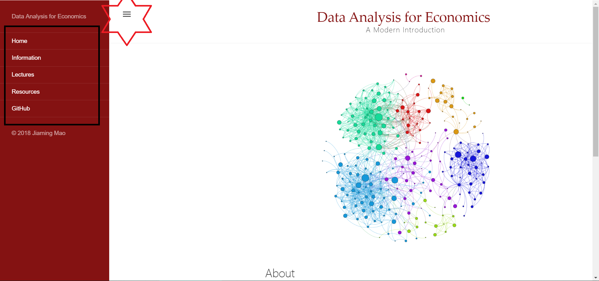

# Outlines of the first TA Session

## The course materials and its organization
## Using git and/or Github desktop to sync course materials
## Installing R and RStudio
## Installing Python
## Introducing LaTeX and Lyx
## Other Materials related to this course(Professor Mao recommend)

# the course materials and its organization

## course homepage (https://jiamingmao.github.io/data-analysis/)

1. course information : the information of instructor,TA and syllabus
2. course lectures : all of the siles on class
3. resources : links to the online resources mainly about data-analysis tools, eg R, Stata, Python et al,.
4. link Github Repository (https://github.com/jiamingmao/data-analysis)

## all of the materials synchronization  (https://github.com/jiamingmao/data-analysis)

## moodle (https://l.xmu.edu.cn/)

1. upload your homework

2. download data and related books in electronical version

## piazza for class related discussion (https://piazza.com/class/jrutcu09qew35q?cid=5)

